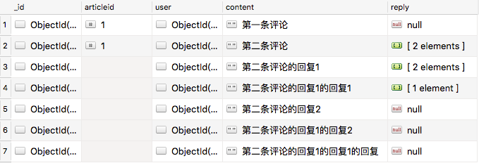

# AraComment

## 说明
个人博客根据文章读取评论的后台系统，以嵌套结构返回结果（Express.js + MongoDB）

相当于给 Mongoose API 的 populate() 函数造了个轮子

## 前端效果
个人使用`Vue.js`，一轮组件递归即可实现


## 后端效果
### 数据库结构（转换前）

```json
[{
    "_id" : ObjectId("5a87cc0dc6b2f35f2a2504d2"),
    "articleid" : 1,
    "user" : ObjectId("5a236879d9117a0d53204c52"),
    "content" : "第一条评论",
    "reply" : null
},
{
    "_id" : ObjectId("5a87d26dc6b2f35f2a250566"),
    "articleid" : 1,
    "user" : ObjectId("5a236879d9117a0d53204c52"),
    "content" : "第二条评论",
    "reply" : [ 
        ObjectId("5a88083ec6b2f35f2a2505b4"), 
        ObjectId("5a8980ee1b4a06a488d9a54a")
    ]
},
{
    "_id" : ObjectId("5a88083ec6b2f35f2a2505b4"),
    "user" : ObjectId("5a236879d9117a0d53204c52"),
    "content" : "第二条评论的回复1",
    "reply" : [ 
        ObjectId("5a8962441513e3a1f4042de3"), 
        ObjectId("5a8981771b4a06a488d9a55d")
    ]
},
{
    "_id" : ObjectId("5a8962441513e3a1f4042de3"),
    "user" : ObjectId("5a236879d9117a0d53204c52"),
    "content" : "第二条评论的回复1的回复1",
    "reply" : [ 
        ObjectId("5a8a529d1b4a06a488d9ab19")
    ]
},
{
    "_id" : ObjectId("5a8980ee1b4a06a488d9a54a"),
    "user" : ObjectId("5a236879d9117a0d53204c52"),
    "content" : "第二条评论的回复2",
    "reply" : null
},
{
    "_id" : ObjectId("5a8981771b4a06a488d9a55d"),
    "user" : ObjectId("5a236879d9117a0d53204c52"),
    "content" : "第二条评论的回复1的回复2",
    "reply" : null
},
{
    "_id" : ObjectId("5a8a529d1b4a06a488d9ab19"),
    "user" : ObjectId("5a236879d9117a0d53204c52"),
    "content" : "第二条评论的回复1的回复1的回复",
    "reply" : null
}]
```

### 嵌套结构（转换后）
```json
[
    {
        "_id":"5a87d26dc6b2f35f2a250566",
        "articleid":1,
        "user":{
            "username": "admin",
            "userId": "xxx"
        },
        "content":"第二条评论",
        "reply":[
            [
                {
                    "_id":"5a88083ec6b2f35f2a2505b4",
                    "user":{
                        "username": "admin",
                        "userId": "xxx"
                    },
                    "content":"第二条评论的回复1",
                    "reply":[
                        [
                            {
                                "_id":"5a8962441513e3a1f4042de3",
                                "user":{
                                    "username": "admin",
                                    "userId": "xxx"
                                },
                                "content":"第二条评论的回复1的回复1",
                                "reply":[
                                    [
                                        {
                                            "_id":"5a8a529d1b4a06a488d9ab19",
                                            "user":{
                                                "username": "admin",
                                                "userId": "xxx"
                                            },
                                            "content":"第二条评论的回复1的回复1的回复",
                                            "reply":null
                                        }
                                    ]
                                ]
                            }
                        ],
                        [
                            {
                                "_id":"5a8981771b4a06a488d9a55d",
                                "user":{
                                    "username": "admin",
                                    "userId": "xxx"
                                },
                                "content":"第二条评论的回复1的回复2",
                                "reply":null
                            }
                        ]
                    ]
                }
            ],
            [
                {
                    "_id":"5a8980ee1b4a06a488d9a54a",
                    "user":{
                        "username": "admin",
                        "userId": "xxx"
                    },
                    "content":"第二条评论的回复2",
                    "reply":null
                }
            ]
        ]
    },
    {
        "_id":"5a87cc0dc6b2f35f2a2504d2",
        "articleid":1,
        "user":{
            "username": "admin",
            "userId": "xxx"
        },
        "content":"第一条评论",
        "reply":null
    }
]
```

## 运行
```bash
#安装依赖
npm install

#生产环境
node app.js

#运行地址（id为文章编号）
http://localhost:3000/api/comment/getbyarticleid/:id
```